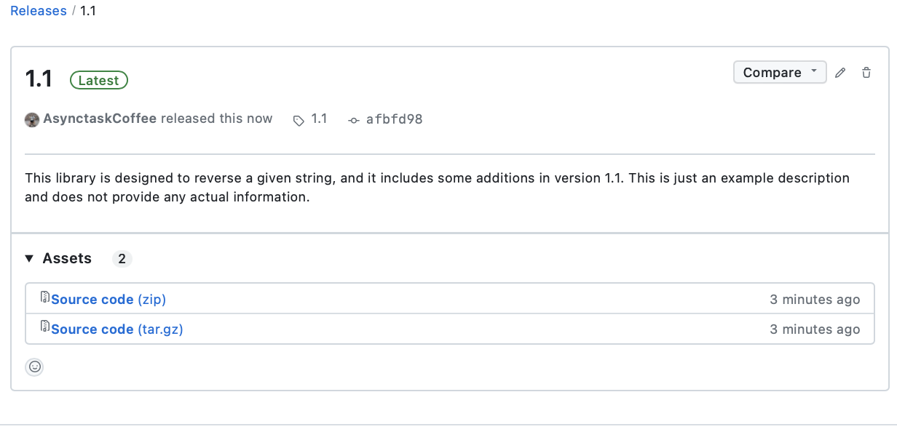

# How to Share a Library on JitPack

This comprehensive guide walks you through the process of sharing your Android library through JitPack. JitPack is a package repository for GitHub, simplifying the distribution and integration of libraries into other projects. Follow the step-by-step instructions below to get started and make your library accessible to developers worldwide.

## Step 1: Create an Android Module
1. In your Android project, right-click and select "New Module."
2. Choose "Android Library" and create the module.
3. Within the module, write the functions you want to share. This module will serve as your library.

   | Step 1.1 - Create an Android Module | Step 1.2 - Select Android Library   | Step 1.3 - Functionalization        |
   | --------------------------------- | --------------------------------- | --------------------------------- |
   |           |           |           |

**Additional Information**: Creating a dedicated module for your library offers several benefits. It allows for better code organization, encapsulation, and reusability. Moreover, it enables you to focus on developing and maintaining a specific set of functionalities that can be easily integrated into other projects.

## Step 2: Share the Project on GitHub
1. Host your project on GitHub and ensure its visibility is set to public. By making your project publicly accessible, you create opportunities for collaboration, feedback, and contributions from the developer community.

**Additional Information**: Sharing your project on GitHub opens doors for engaging with other developers, obtaining valuable feedback, and fostering collaboration. It provides a platform to showcase your work and make it accessible to a broader audience.

## Step 3: Create a Library Version on GitHub
1. Go to your GitHub project page and navigate to the "Release" tab.
2. Create a new release to define a version for your library. Specify the version number, provide a detailed description of the release, and include any relevant version-specific information or updates.
3. Click on "Release" to publish the library version.

   | Step 3.1 - Create a Release on GitHub | Step 3.2 - Fill library details on GitHub | Step 3.3 - Click on "Release" |
   | ------------------------------------------ | ------------------------------------------ | ------------------------------------------ |
   |                      |                      |                      

**Additional Information**: Creating distinct versions for your library allows users to choose a specific release based on their requirements and compatibility needs. By documenting the changes and improvements in each version, you provide developers with a clear understanding of the library's evolution.

## Step 4: Share Your Library on JitPack
1. Once you have released a version on GitHub, your library is automatically prepared for sharing through JitPack.
2. Go to jitpack.io and log in using your GitHub account.
3. Paste the repository URL into the provided field.
4. Click on "Get it" to initiate the process of making your library available on JitPack.
5. JitPack will generate the necessary build artifacts and provide instructions on how to import and use your library in other projects.

   | Step 4.1 - Share Your Library on JitPack |
   | ------------------------------------- |
   |                 |

**Additional Information**: JitPack seamlessly integrates with your GitHub repository, automating the build process and simplifying library distribution. It supports various build systems, including Gradle and Maven, making it easier for developers to incorporate your library into their projects.

## Personal Growth and Contribution in Open-Source Projects
Publishing libraries and contributing to open-source projects offer several benefits to developers:

- **Personal Growth**: By sharing your libraries, you gain exposure to a wider developer community. Collaborating with others, receiving feedback, and engaging in discussions can enhance your skills and broaden your perspectives.
- **Knowledge Sharing**: Contributing to open-source projects allows you to share your expertise and insights with others. It fosters a culture of knowledge exchange, benefiting the entire software development community.
- **Portfolio Enhancement**: Publishing libraries and actively participating in open-source projects serve as valuable additions to your professional portfolio. They demonstrate your technical capabilities, problem-solving skills, and commitment to the software development community.
- **Collaboration Opportunities**: Open-source projects provide opportunities to collaborate with developers from diverse backgrounds. Working together on a shared codebase exposes you to different coding styles, development methodologies, and best practices.
- **Recognition and Networking**: Contributing to open-source projects can lead to recognition within the developer community. It provides opportunities to network with like-minded individuals, potential employers, and industry experts.

**Additional Information**: When contributing to open-source projects, it is important to follow the project's guidelines, contribute meaningfully, and be respectful of the existing community. Engaging in discussions, submitting bug reports, providing documentation updates, and proposing new features are all valuable ways to contribute.

By sharing your libraries and actively participating in open-source projects, you contribute to the growth and advancement of the software development community as a whole. The knowledge and experience gained from these endeavors can have a significant impact on your personal growth as a developer.
